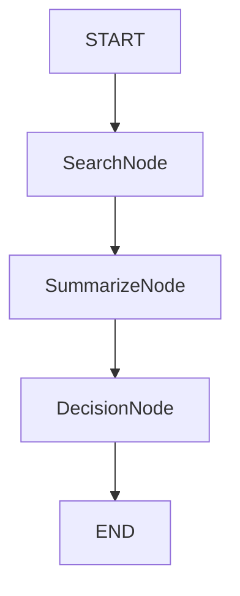

# Design: LangGraph 编排设计

## Context
我们将从线性的 `搜索 -> 摘要 -> 决策` 流水线迁移到基于 `LangGraph` 的图编排。这使得循环工作流、状态持久化和更好的错误处理成为可能。

## Goals
- **正式状态**：定义清晰的架构用于 Agent 间的数据传递。
- **模块化**：将编排逻辑与 Agent 具体实现解耦。
- **扩展性**：使后续添加新节点（如“风险审核”、“人工审批”）变得容易。

## Data Model: AgentState
我们将定义一个 `TypedDict` 来表示分析工作流的全局状态。

```python
from typing import TypedDict, Annotated, List, Optional, Any, Dict
from langchain_core.messages import BaseMessage
import operator

class AgentState(TypedDict):
    stock_code: str
    stock_name: str
    date: str
    
    # 上下文数据
    technical_context: Dict[str, Any]
    
    # 分析产物
    raw_news: Optional[str]
    news_summary: Optional[str]
    analysis_result: Optional[Dict[str, Any]] # 来自 DecisionAgent 的最终 JSON
    
    # 工作流控制
    errors: List[str]
    messages: Annotated[List[BaseMessage], operator.add] # 用于聊天历史/日志
```

## Graph Topology

### 初始版本 (线性流程重构)


### 节点职责
1. **SearchNode**: 
    - 输入：`stock_code`, `stock_name`。
    - 动作：调用 `SearchService`。
    - 输出：更新 `raw_news`。
2. **SummarizeNode**:
    - 输入：`raw_news`。
    - 动作：如果存在 `raw_news`，则调用 `SummarizerAgent`。
    - 输出：更新 `news_summary`。
3. **DecisionNode**:
    - 输入：`technical_context`, `news_summary`。
    - 动作：调用 `DecisionAgent`。
    - 输出：更新 `analysis_result`。

## Decisions
- **库选择**：使用 `langgraph` 进行编排，使用 `langchain-core` 定义消息类型。
- **Agent 包装**：保留现有的 `SummarizerAgent` 和 `DecisionAgent` 类。节点本质上是调用这些类的轻量级包装器。
- **错误处理**：节点将捕获异常并将其附加到状态中的 `errors` 列表，而不是立即导致整个图崩溃（除非是关键错误）。

## Migration Plan
1. 添加依赖项。
2. 在 `analysis/orchestrator.py` 中实现 `AgentState` 和节点函数。
3. 重写 `LLMOrchestrator.analyze` 以编译并运行图。